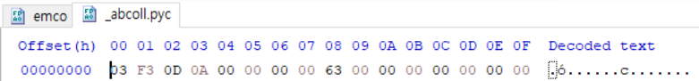
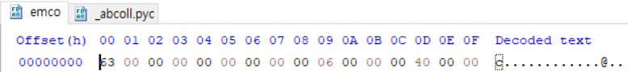

When I excute the file and attack debugger to it, I can find it was written by python.  
So I use ```python-exe-unpacker```. There are so many package, but main logic is in ```emco``` file.  
```emco``` has no signatue and extended, but I can simply read it by add signature on file header and add extend ```.pyc``` and decompile it. 
Find another ```.pyc``` file, and compare it to ```emco``` file, and signature is ```03 F3 0D 0A 00 00 00 00```.(It may different on other project)  

  
Make 2nd file like 1st file.  
Add this signature on ```emco``` and rename it ```emco.pyc```, and use ````uncompyle6``` to decompile the pyc file.  
Main logic is like this:  
```python
def encrypt(file_path):
    im = Image.open(file_path).convert('RGB')
    width, height = im.size
    pixels = list(im.getdata())
    pixels = [ pixels[i * width:(i + 1) * width] for i in range(height) ]
    binary_pixels = []
    for item in pixels:
        for pixel in item:
            if pixel == (255, 255, 255):
                binary_pixels.append('0')
            else:
                binary_pixels.append('1')
    
    line = ''.join(binary_pixels)
    n = 8
    enc = [ int(line[i:i + n], 2) for i in range(0, len(line), n) ]
    data = ''
    enc_len = len(enc)
    s = int(sqrt(enc_len))
    for i in range(enc_len):
        data += chr(125) + chr(0) + chr(enc[i])
    im2 = Image.frombytes('RGB', (s, s), data.encode())
    im2.save('encrypted.png', 'PNG')
```
I do some test and get sure that logic is only use for app and other package is just trick.(like all crypto, ssl, ftp and other.)  
So I write decrypt function in python.
```python
def decrypt(file_path):
    im = Image.open(file_path).convert('RGB')
    pixels = list(im.getdata())
    for i in range(100):
        pixels.append((125,0,0))
    data =[]
    for pixel in pixels:
        data.append(pixel[2])
    line = ''
    for p in data:
        t = "{0:b}".format(p)
        if len(t) < 8:
            t = '0'*(8-len(t)) + t
        line += t
    original = []
    for ch in line:
        if ch == '0':
            original.append((255,255,255))
        else:
            original.append((0,0,0))
    res = b''
    for o in original:
        res += bytes([o[0]]) + bytes([o[1]]) + bytes([o[2]])
    print(len(res), 40000)
    im2 = Image.frombytes('RGB', (200, 200), res)
    pixels = list(im2.getdata())
    print(pixels)
    im2.save("target.png", "PNG")
```
And run the code, I get QR code.
Flag is ```infernoCTF{w04h_3ncrypt3d_qr_d4yumnnn}```
